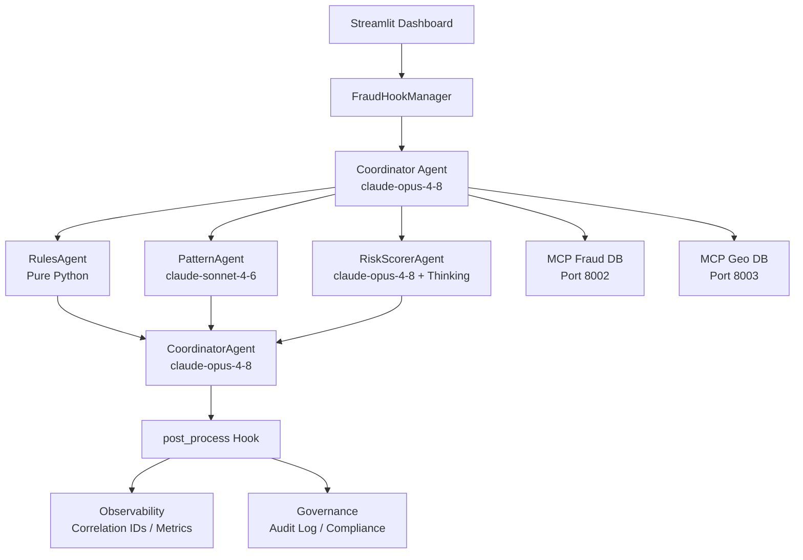

# Architecture Diagram — Fraud Detection AI Agent

## System Architecture

```
┌──────────────────────────────────────────────────────────────────────┐
│                        USER / BROWSER                                │
│                    (Streamlit Dashboard)                              │
└───────────────────────────┬──────────────────────────────────────────┘
                            │  HTTP
                            ▼
┌──────────────────────────────────────────────────────────────────────┐
│                  fraud_detection/app.py                               │
│            (Streamlit UI — Charts, Tables, Forms)                     │
└───────────────────────────┬──────────────────────────────────────────┘
                            │ Python function call
                            ▼
┌──────────────────────────────────────────────────────────────────────┐
│              FraudHookManager (fraud_detection/hooks.py)             │
│                                                                      │
│  pre_process()                          post_process()               │
│   ├─ Rate limit check                   ├─ Compliance check          │
│   ├─ Input sanitization                 ├─ Fairness check            │
│   ├─ Schema validation                  ├─ Audit log (audit.jsonl)   │
│   └─ Correlation ID (UUID)              └─ Emit metrics              │
└───────────────────────────┬──────────────────────────────────────────┘
                            │
                            ▼
┌──────────────────────────────────────────────────────────────────────┐
│         FraudDetectionOrchestrator  (fraud_detection/agent.py)       │
│                   *** COORDINATOR AGENT ***                          │
│           (Model: claude-opus-4-8)                                   │
│                                                                      │
│  ┌──────────────────┐   ┌─────────────────┐   ┌──────────────────┐  │
│  │   RulesAgent     │   │  PatternAgent   │   │ RiskScorerAgent  │  │
│  │                  │   │                 │   │                  │  │
│  │ Pure Python      │   │ claude-sonnet   │   │ claude-opus +    │  │
│  │ No LLM call      │   │ Behavioral      │   │ Extended Thinking│  │
│  │ Fast & testable  │   │ analysis        │   │ (Autonomous Plan)│  │
│  │                  │   │                 │   │                  │  │
│  │ Checks:          │   │ Checks:         │   │ Checks:          │  │
│  │ ✓ High amount    │   │ ✓ Pattern fit   │   │ ✓ Risk score     │  │
│  │ ✓ Unusual loc.   │   │ ✓ Account       │   │ ✓ Reasoning      │  │
│  │ ✓ Rapid succession│  │   takeover signs│   │   chain          │  │
│  │ ✓ International  │   │ ✓ Velocity fraud│   │ ✓ Final weight   │  │
│  └──────────────────┘   └─────────────────┘   └──────────────────┘  │
│                                                                      │
│  CoordinatorAgent synthesizes → Safe / Suspicious / High Risk        │
└────────────┬──────────────────────────────────────┬─────────────────┘
             │                                       │
             ▼                                       ▼
┌────────────────────────┐          ┌────────────────────────────────┐
│  shared/observability  │          │       MCP Servers               │
│                        │          │                                 │
│  ✓ Correlation IDs     │          │  ┌──────────────────────────┐  │
│  ✓ Agent traces        │          │  │  mcp_server_fraud.py     │  │
│  ✓ Decision log        │          │  │  Port: 8002              │  │
│  ✓ Metrics (count/avg) │          │  │                          │  │
└────────────────────────┘          │  │  Tools:                  │  │
                                    │  │  get_transaction_history │  │
┌────────────────────────┐          │  │  get_fraud_blacklist     │  │
│  shared/governance     │          │  │  report_fraud_txn        │  │
│                        │          │  │  get_fraud_statistics    │  │
│  ✓ Input validation    │          │  └──────────────────────────┘  │
│  ✓ Compliance check    │          │                                 │
│  ✓ Fairness flags      │          │  ┌──────────────────────────┐  │
│  ✓ Audit log (JSONL)   │          │  │  mcp_server_geo.py       │  │
│  ✓ Rate limiter        │          │  │  Port: 8003              │  │
└────────────────────────┘          │  │                          │  │
                                    │  │  Tools:                  │  │
                                    │  │  get_country_risk_score  │  │
                                    │  │  check_ip_location       │  │
                                    │  │  get_high_risk_regions   │  │
                                    │  │  verify_domestic_location│  │
                                    │  └──────────────────────────┘  │
                                    └────────────────────────────────┘
```

## Data Flow

```
Transaction Input
      │
      ▼
[1] FraudHookManager.pre_process()
      ├── Rate Limit Check
      ├── Sanitize & Validate
      └── Generate Correlation ID
      │
      ▼
[2] RulesAgent (Python)
      ├── check_high_amount()
      ├── check_unusual_location()
      ├── check_rapid_succession()
      └── check_international()
      │
      ▼
[3] PatternAgent (claude-sonnet-4-6)
      └── Behavioral analysis
      │
      ▼
[4] RiskScorerAgent (claude-opus-4-8 + Extended Thinking)
      └── calculate_fraud_score tool call
      │
      ▼
[5] CoordinatorAgent (claude-opus-4-8)
      └── generate_fraud_report tool call
      │
      ▼
[6] FraudHookManager.post_process()
      ├── Compliance Check
      ├── Fairness Flag
      ├── Audit Log → audit.jsonl
      └── Emit Metrics
      │
      ▼
[7] Result: {risk_level, fraud_reasons, risk_score, explanation, agent_trace}
      │
      ▼
[8] Streamlit Dashboard Display
```

## Mermaid Diagram (for tools that render Mermaid)


