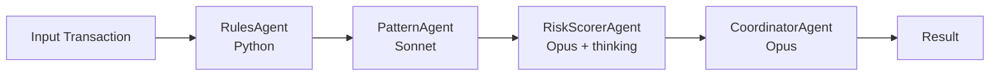

# 🧠 Orchestrator Agent

Source: `orchestrator/agent.py` · Definition: `.claude/agents/agent.md` · See also: [[../Architecture]]

---

## Role

Coordinates the 4-agent fraud detection pipeline. Accepts a raw transaction dict, passes it through Rules → Pattern → Risk Scorer → Coordinator in sequence, and returns the final result.

## Class: `FraudDetectionOrchestrator`

**Main method:**
```python
orchestrator = FraudDetectionOrchestrator()
result = orchestrator.analyze(transaction, all_transactions)
```

**Returns:**
```python
{
    "transaction_id":     "TXN001",
    "risk_level":         "Safe",          # Safe / Suspicious / High Risk
    "risk_score":         float,            # 0–100
    "fraud_reasons":      [str, ...],
    "explanation":        str,              # markdown-formatted
    "recommended_action": str,              # none / alert_customer / block_transaction
    "agent_trace":        [dict, ...],
    "correlation_id":     str,              # UUID
    "confidence":         float,            # 0.0–1.0
    "pattern_analysis":   str,
}
```

**Batch method:**
```python
results = orchestrator.analyze_all(transactions)  # list of result dicts
```

---

## Sub-Agent Pipeline



---

## Retry & Self-Healing

- Max retries: 3 (configurable via `config.MAX_RETRIES`)
- Backoff: exponential (1s, 2s, 4s)
- Handles: `anthropic.RateLimitError`, `anthropic.APIError`
- Fallback: returns `"Suspicious"` on final failure

---

## Sub-Agents

- [[Rules-Agent]]
- [[Pattern-Agent]]
- [[Risk-Scorer-Agent]]
- [[Coordinator-Agent]]
