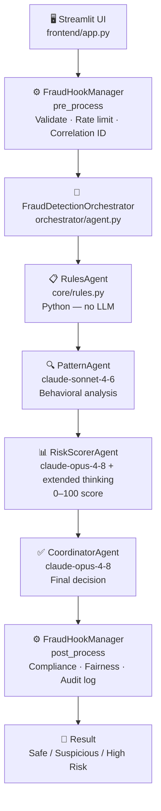
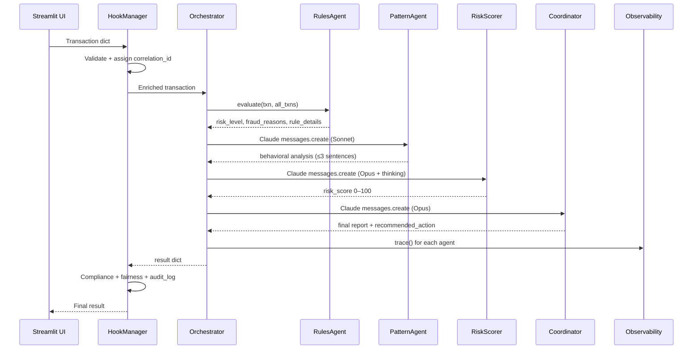

# 🏗️ System Architecture

Source: `orchestrator/agent.py` · See also: [[Home]], [[Agents/Orchestrator]]

---

## Agent Pipeline



---

## Data Flow



---

## Directory Map

```
capstone/
├── frontend/app.py          ← Streamlit dashboard (entry point)
├── orchestrator/agent.py    ← Multi-agent coordinator
├── core/
│   ├── rules.py             ← 4 fraud rules (pure Python)
│   ├── data.py              ← 22 sample transactions
│   ├── tools.py             ← Claude tool schemas
│   ├── hooks.py             ← Pre/post middleware
│   ├── governance.py        ← Compliance, audit, rate limiter
│   └── graph.py             ← NetworkX property graph
├── mcp/
│   ├── mcp_server_fraud.py  ← Port 8002
│   ├── mcp_server_geo.py    ← Port 8003
│   └── mcp_server_orchestrator.py ← Port 8004
├── observability/
│   └── observability.py     ← OTEL + in-memory traces
├── rag/retriever.py         ← TF-IDF knowledge retriever
├── config/settings.py       ← All thresholds and model names
└── tests/                   ← pytest unit + integration tests
```
